# Домашнее задание к занятию 5. «Практическое применение Docker»

## Задача 1

Создайте файл ```Dockerfile.python``` на основе существующего `Dockerfile`:
   - Используйте базовый образ ```python:3.12-slim```
   - Обязательно используйте конструкцию ```COPY . .``` в Dockerfile
   - Создайте `.dockerignore` файл для исключения ненужных файлов
   - Используйте ```CMD ["uvicorn", "main:app", "--host", "0.0.0.0", "--port", "5000"]``` для запуска
   - Протестируйте корректность сборки

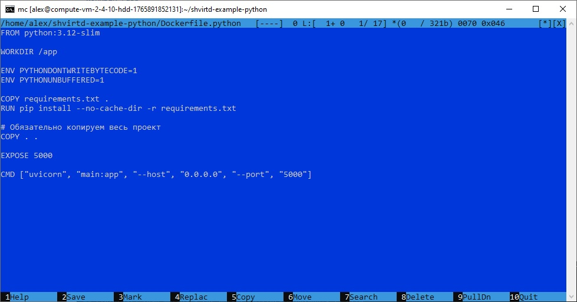
 
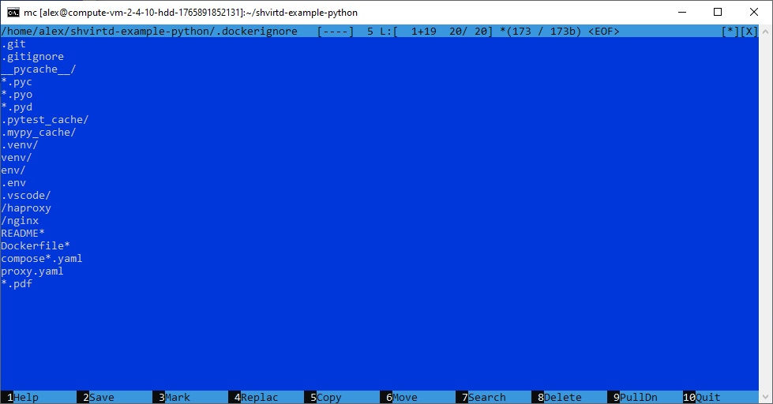
 
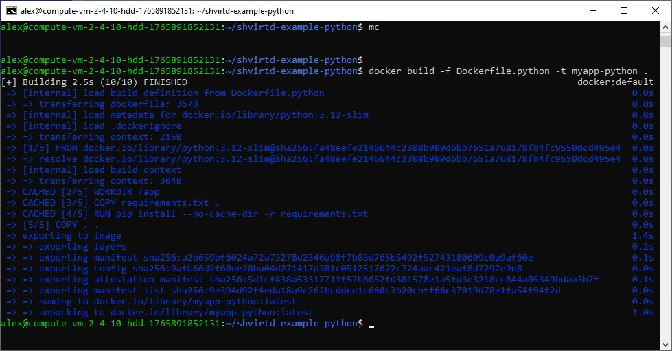
 
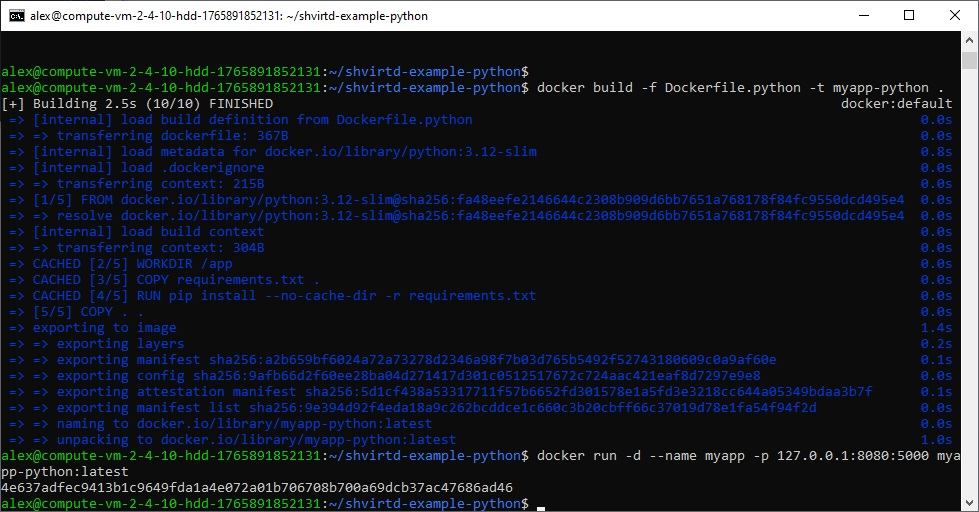     

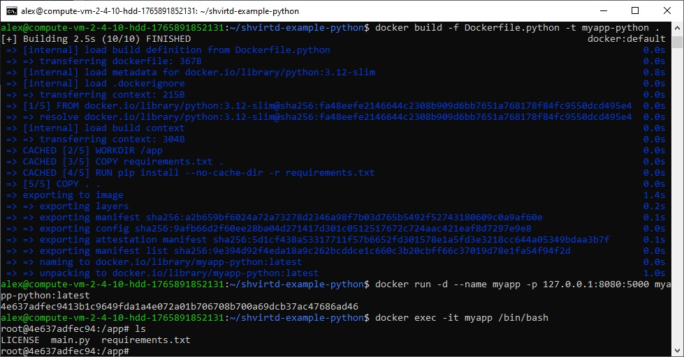   

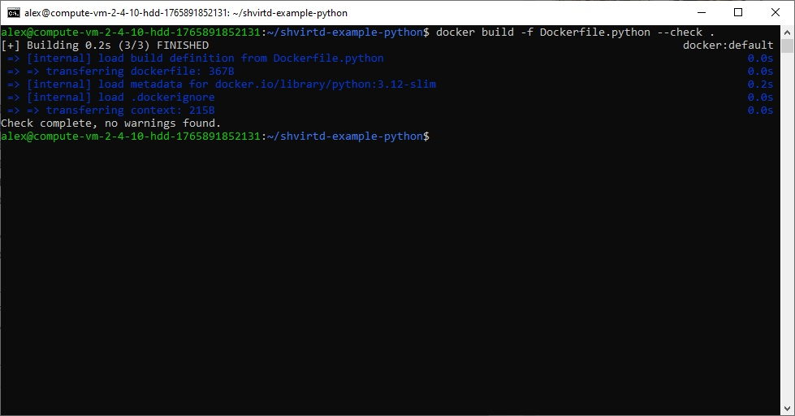     
     
(Необязательная часть, *) Изучите инструкцию в проекте и запустите web-приложение без использования docker, с помощью venv. (Mysql БД можно запустить в docker run).

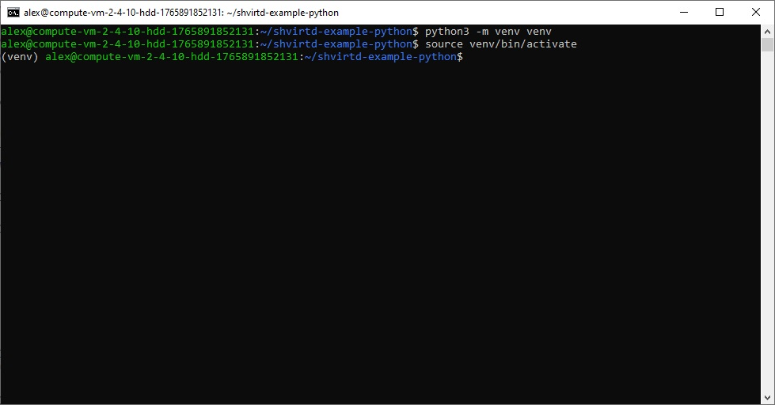     

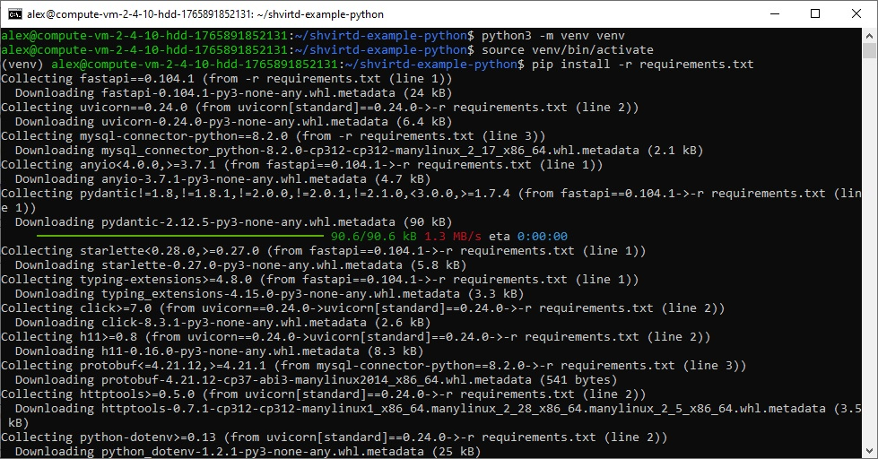     

     

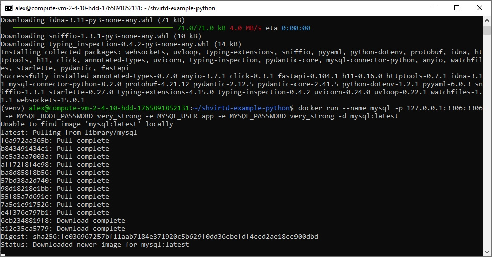     

     

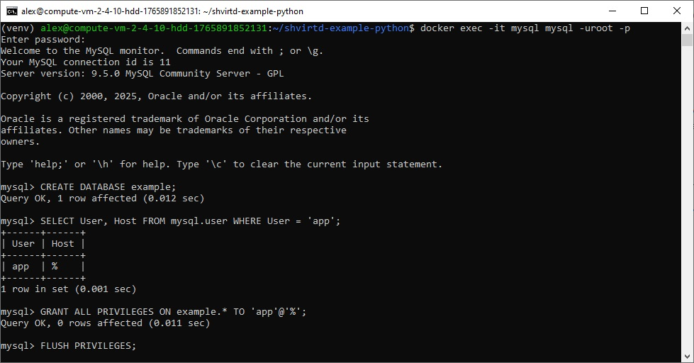     

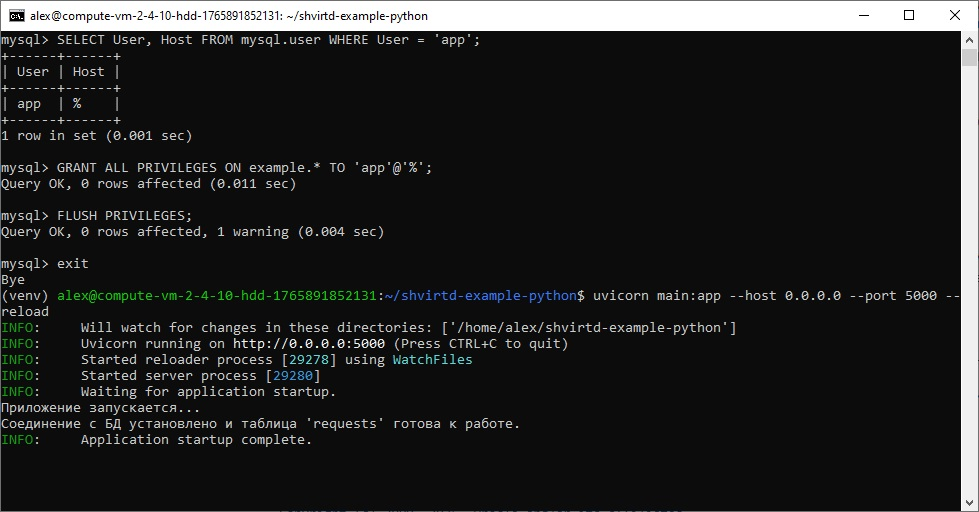     

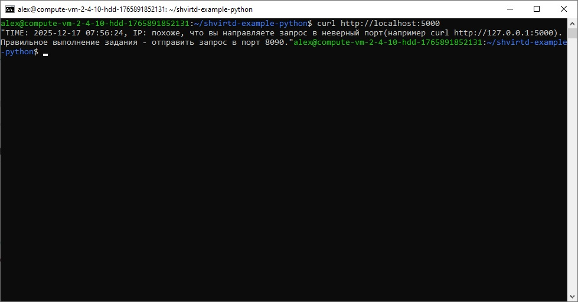     

(Необязательная часть, *) Изучите код приложения и добавьте управление названием таблицы через ENV переменную.

```python
# main.py
from datetime import datetime
import os
from contextlib import contextmanager, asynccontextmanager

import mysql.connector
from fastapi import FastAPI, Request, Depends, HTTPException, Header
from typing import Optional

# --- 1. Конфигурация ---
# Считываем конфигурацию БД из переменных окружения
db_host = os.environ.get('DB_HOST', '127.0.0.1')
db_user = os.environ.get('DB_USER', 'app')
db_password = os.environ.get('DB_PASSWORD', 'very_strong')
db_name = os.environ.get('DB_NAME', 'example')

# Новая переменная для имени таблицы
TABLE_NAME_DEFAULT = 'requests'
TABLE_NAME = os.environ.get('DB_TABLE_NAME', TABLE_NAME_DEFAULT) or TABLE_NAME_DEFAULT
TABLE_NAME = TABLE_NAME.strip()

# --- 2. Управление соединением с БД ---
@contextmanager
def get_db_connection():
    db = None
    try:
        db = mysql.connector.connect(
            host=db_host,
            user=db_user,
            password=db_password,
            database=db_name
        )
        yield db
    finally:
        if db is not None and db.is_connected():
            db.close()

# --- 4. Асинхронная функция lifespan (инициализация БД) ---
@asynccontextmanager
async def lifespan(app: FastAPI):
    # Код, который выполнится перед запуском приложения
    print("Приложение запускается...")
    try:
        with get_db_connection() as db:
            cursor = db.cursor()
            create_table_query = f"""
            CREATE TABLE IF NOT EXISTS {db_name}.{TABLE_NAME} (
                id INT AUTO_INCREMENT PRIMARY KEY,
                request_date DATETIME,
                request_ip VARCHAR(255)
            )
            """
            cursor.execute(create_table_query)
            db.commit()
            cursor.close()
            print(f"Соединение с БД установлено и таблица '{TABLE_NAME}' готова к работе.")
    except mysql.connector.Error as err:
        print(f"Ошибка при подключении к БД или создании таблицы: {err}")
    
    yield
    
    # Код, который выполнится при остановке приложения
    print("Приложение останавливается.")

# Создаем экземпляр FastAPI с использованием lifespan
app = FastAPI(
    title="Shvirtd Example FastAPI",
    description="Учебный проект, FastAPI+Docker.",
    version="1.0.0",
    lifespan=lifespan
)

# --- 3. Зависимость для получения IP ---
def get_client_ip(x_real_ip: Optional[str] = Header(None)):
    return x_real_ip

# --- 5. Основной эндпоинт ---
@app.get("/")
def index(request: Request, ip_address: Optional[str] = Depends(get_client_ip)):
    final_ip = ip_address  # Только из X-Forwarded-For, без fallback

    now = datetime.now()
    current_time = now.strftime("%Y-%m-%d %H:%M:%S")

    try:
        with get_db_connection() as db:
            cursor = db.cursor()
            query = f"INSERT INTO {db_name}.{TABLE_NAME} (request_date, request_ip) VALUES (%s, %s)"
            values = (current_time, final_ip)
            cursor.execute(query, values)
            db.commit()
            cursor.close()
    except mysql.connector.Error as err:
        raise HTTPException(status_code=500, detail=f"Ошибка при работе с базой данных: {err}")

    # Подсказка для студентов при неправильном обращении
    if final_ip is None:
        ip_display = "похоже, что вы направляете запрос в неверный порт(например curl http://127.0.0.1:5000). Правильное выполнение задания - отправить запрос в порт 8090."
    else:
        ip_display = final_ip

    return f'TIME: {current_time}, IP: {ip_display}'

# --- 6. Эндпоинт для просмотра записей в БД ---
@app.get("/requests")
def get_requests():
    """Возвращает все записи из таблицы TABLE_NAME для проверки"""
    try:
        with get_db_connection() as db:
            cursor = db.cursor()
            query = f"SELECT id, request_date, request_ip FROM {db_name}.{TABLE_NAME} ORDER BY id DESC LIMIT 50"
            cursor.execute(query)
            records = cursor.fetchall()
            cursor.close()
            
            # Преобразуем записи в читабельный формат
            result = []
            for record in records:
                result.append({
                    "id": record[0],
                    "request_date": record[1].strftime("%Y-%m-%d %H:%M:%S") if record[1] else None,
                    "request_ip": record[2]
                })
            
            return {
                "total_records": len(result),
                "records": result
            }
    except mysql.connector.Error as err:
        raise HTTPException(status_code=500, detail=f"Ошибка при чтении из базы данных: {err}")

# --- 7. Запуск приложения ---
# Для запуска этого файла используется ASGI-сервер, например, uvicorn.
# Команда: uvicorn main:app --reload
if __name__ == '__main__':
    import uvicorn
    uvicorn.run(app, host='0.0.0.0', port=5000)


---
### ВНИМАНИЕ!
!!! В процессе последующего выполнения ДЗ НЕ изменяйте содержимое файлов в fork-репозитории! Ваша задача ДОБАВИТЬ 5 файлов: ```Dockerfile.python```, ```compose.yaml```, ```.gitignore```, ```.dockerignore```,```bash-скрипт```. Если вам понадобилось внести иные изменения в проект - вы что-то делаете неверно!
---

## Задача 2 (*)
1. Создайте в yandex cloud container registry с именем "test" с помощью "yc tool" . [Инструкция](https://cloud.yandex.ru/ru/docs/container-registry/quickstart/?from=int-console-help)
2. Настройте аутентификацию вашего локального docker в yandex container registry.
3. Соберите и залейте в него образ с python приложением из задания №1.
4. Просканируйте образ на уязвимости.
5. В качестве ответа приложите отчет сканирования.

## Задача 3
1. Изучите файл "proxy.yaml"
2. Создайте в репозитории с проектом файл ```compose.yaml```. С помощью директивы "include" подключите к нему файл "proxy.yaml".
3. Опишите в файле ```compose.yaml``` следующие сервисы: 

- ```web```. Образ приложения должен ИЛИ собираться при запуске compose из файла ```Dockerfile.python``` ИЛИ скачиваться из yandex cloud container registry(из задание №2 со *). Контейнер должен работать в bridge-сети с названием ```backend``` и иметь фиксированный ipv4-адрес ```172.20.0.5```. Сервис должен всегда перезапускаться в случае ошибок.
Передайте необходимые ENV-переменные для подключения к Mysql базе данных по сетевому имени сервиса ```web``` 

- ```db```. image=mysql:8. Контейнер должен работать в bridge-сети с названием ```backend``` и иметь фиксированный ipv4-адрес ```172.20.0.10```. Явно перезапуск сервиса в случае ошибок. Передайте необходимые ENV-переменные для создания: пароля root пользователя, создания базы данных, пользователя и пароля для web-приложения.Обязательно используйте уже существующий .env file для назначения секретных ENV-переменных!

2. Запустите проект локально с помощью docker compose , добейтесь его стабильной работы: команда ```curl -L http://127.0.0.1:8090``` должна возвращать в качестве ответа время и локальный IP-адрес. Если сервисы не стартуют воспользуйтесь командами: ```docker ps -a ``` и ```docker logs <container_name>``` . Если вместо IP-адреса вы получаете информационную ошибку --убедитесь, что вы шлете запрос на порт ```8090```, а не 5000.

5. Подключитесь к БД mysql с помощью команды ```docker exec -ti <имя_контейнера> mysql -uroot -p<пароль root-пользователя>```(обратите внимание что между ключем -u и логином root нет пробела. это важно!!! тоже самое с паролем) . Введите последовательно команды (не забываем в конце символ ; ): ```show databases; use <имя вашей базы данных(по-умолчанию example)>; show tables; SELECT * from requests LIMIT 10;```.

6. Остановите проект. В качестве ответа приложите скриншот sql-запроса.

## Задача 4
1. Запустите в Yandex Cloud ВМ (вам хватит 2 Гб Ram).
2. Подключитесь к Вм по ssh и установите docker.
3. Напишите bash-скрипт, который скачает ваш fork-репозиторий в каталог /opt и запустит проект целиком.
4. Зайдите на сайт проверки http подключений, например(или аналогичный): ```https://check-host.net/check-http``` и запустите проверку вашего сервиса ```http://<внешний_IP-адрес_вашей_ВМ>:8090```. Таким образом трафик будет направлен в ingress-proxy. Трафик должен пройти через цепочки: Пользователь → Internet → Nginx → HAProxy → FastAPI(запись в БД) → HAProxy → Nginx → Internet → Пользователь
5. (Необязательная часть) Дополнительно настройте remote ssh context к вашему серверу. Отобразите список контекстов и результат удаленного выполнения ```docker ps -a```
6. Повторите SQL-запрос на сервере и приложите скриншот и ссылку на fork.

## Задача 5 (*)
1. Напишите и задеплойте на вашу облачную ВМ bash скрипт, который произведет резервное копирование БД mysql в директорию "/opt/backup" с помощью запуска в сети "backend" контейнера из образа ```schnitzler/mysqldump``` при помощи ```docker run ...``` команды. Подсказка: "документация образа."
2. Протестируйте ручной запуск
3. Настройте выполнение скрипта раз в 1 минуту через cron, crontab или systemctl timer. Придумайте способ не светить логин/пароль в git!!
4. Предоставьте скрипт, cron-task и скриншот с несколькими резервными копиями в "/opt/backup"

## Задача 6
Скачайте docker образ ```hashicorp/terraform:latest``` и скопируйте бинарный файл ```/bin/terraform``` на свою локальную машину, используя dive и docker save.
Предоставьте скриншоты  действий .

## Задача 6.1
Добейтесь аналогичного результата, используя docker cp.  
Предоставьте скриншоты  действий .

## Задача 6.2 (**)
Предложите способ извлечь файл из контейнера, используя только команду docker build и любой Dockerfile.  
Предоставьте скриншоты  действий .

## Задача 7 (***)
Запустите ваше python-приложение с помощью runC, не используя docker или containerd.  
Предоставьте скриншоты  действий .

